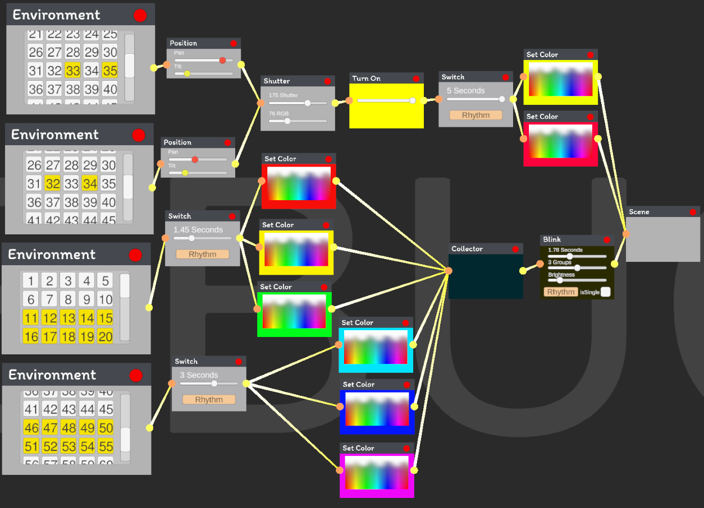
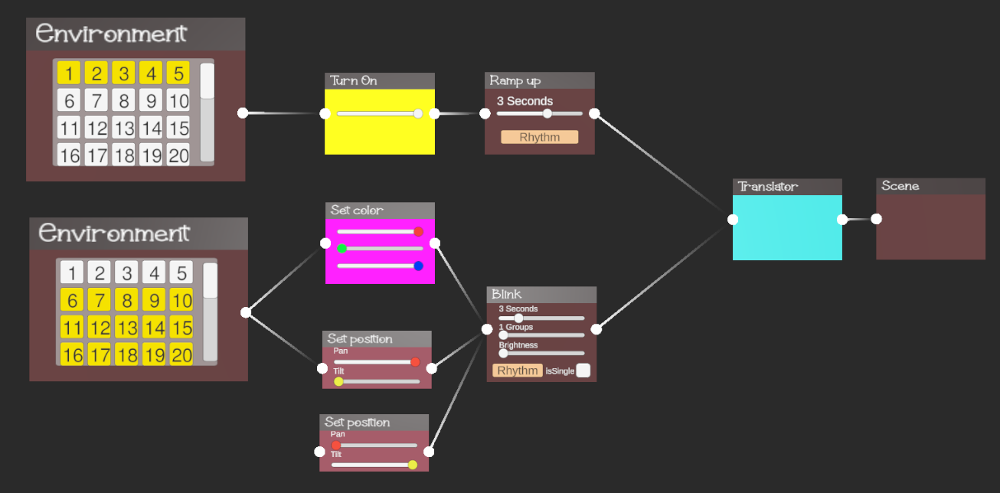

# 🗲 LightMAN (Lighting Manipulator)

Used by junior lighting designers to get their first experience of mixing color with sound using simple node-like blocks and an user-friendly interface.

## Authors

- [@DerwesX](https://github.com/derwesx) - Member of Letovo Stage Crew group.

## Demo

Currently, project is build from 2 parts:

    1. Python Backend with API
    2. Unity Visualizer

First release version will be published before the end of May 2024.
## Screenshots

### Version 1.1

### Version 1.0

